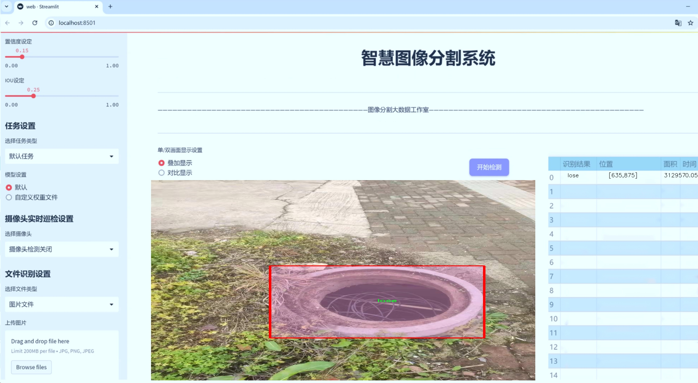
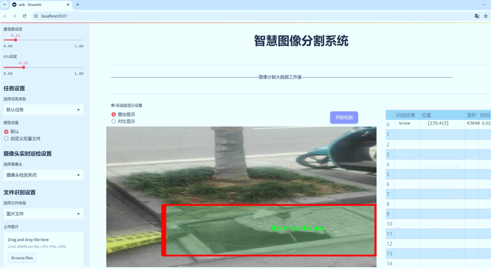
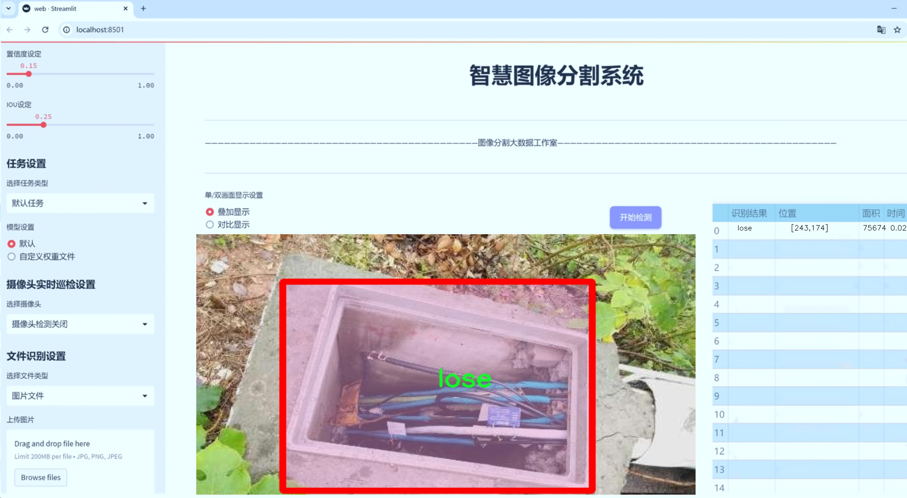
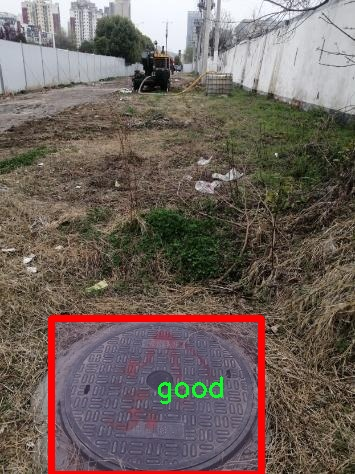
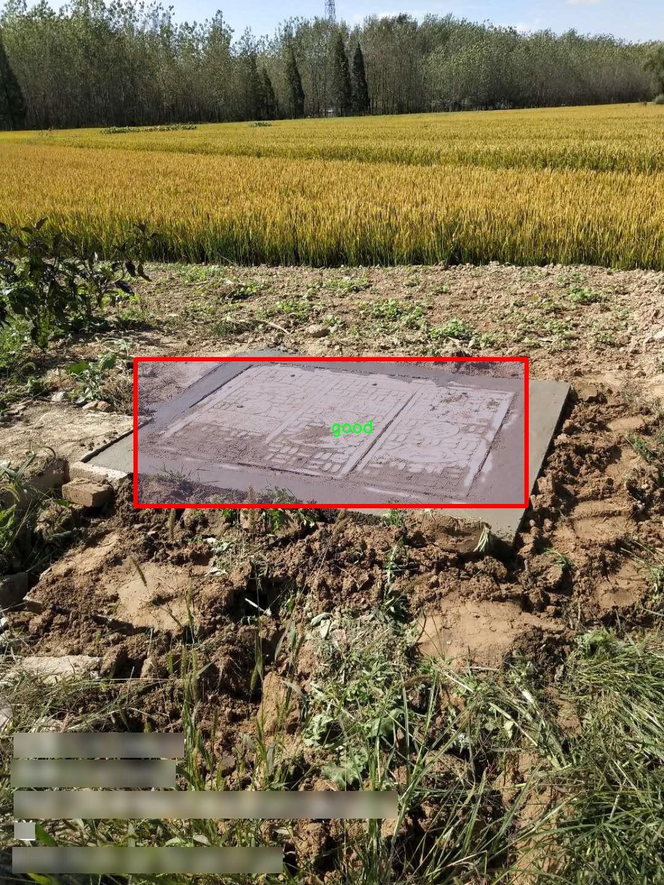
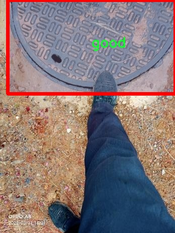
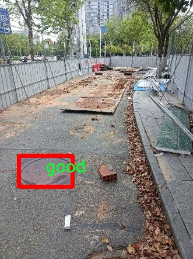
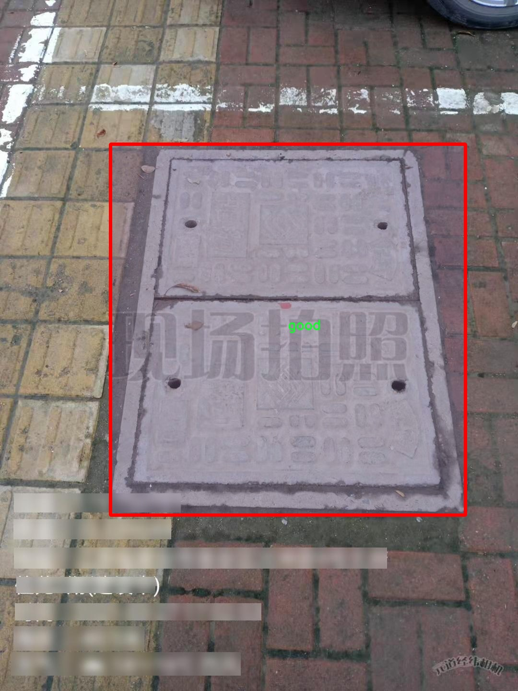

# 井盖状态分割系统： yolov8-seg-EfficientRepBiPAN

### 1.研究背景与意义

[参考博客](https://gitee.com/YOLOv8_YOLOv11_Segmentation_Studio/projects)

[博客来源](https://kdocs.cn/l/cszuIiCKVNis)

研究背景与意义

随着城市化进程的加快，城市基础设施的管理与维护显得愈发重要。其中，井盖作为城市排水系统的重要组成部分，其状态的良好与否直接影响到城市的安全与交通顺畅。然而，传统的井盖检查方法多依赖人工巡检，效率低下且容易受到人为因素的影响，无法及时发现井盖的损坏、丢失或其他异常情况。因此，开发一种高效、准确的井盖状态监测系统，成为了当前城市管理中的一项重要任务。

近年来，深度学习技术的迅猛发展为图像处理和物体检测提供了新的解决方案。YOLO（You Only Look Once）系列模型因其实时性和高准确率而广泛应用于目标检测领域。YOLOv8作为该系列的最新版本，具备了更强的特征提取能力和更快的推理速度，适合用于复杂场景下的目标检测与分割任务。然而，针对井盖状态的特定需求，YOLOv8模型仍需进行改进，以提高其在井盖状态分割中的表现。

本研究旨在基于改进的YOLOv8模型，构建一个高效的井盖状态分割系统。我们使用的数据集包含1300张图像，涵盖了五种井盖状态类别：破损（broke）、完整（good）、丢失（lose）、圆形（circle）和未覆盖（uncovered）。这些类别不仅反映了井盖的物理状态，还为模型的训练提供了丰富的样本，确保其在实际应用中的泛化能力。通过对这些数据的深入分析与处理，我们希望能够训练出一个能够准确识别和分割不同状态井盖的深度学习模型。

本研究的意义在于，首先，它将推动城市基础设施智能化管理的发展，通过高效的井盖状态监测系统，提升城市管理的智能化水平，减少人工巡检的工作量和成本。其次，改进YOLOv8模型的研究将为目标检测领域提供新的思路和方法，尤其是在实例分割任务中，如何针对特定应用场景进行模型优化，将是一个重要的研究方向。此外，井盖状态监测的成功应用还将为其他城市基础设施的智能监测提供借鉴，推动更广泛的应用场景，如道路、桥梁等的状态监测。

综上所述，基于改进YOLOv8的井盖状态分割系统的研究，不仅具有重要的学术价值，也具备广泛的实际应用前景。通过该系统的构建与优化，我们期望能够为城市管理提供一种新型的技术手段，提升城市基础设施的安全性与管理效率，为构建智慧城市贡献力量。

### 2.图片演示







注意：本项目提供完整的训练源码数据集和训练教程,由于此博客编辑较早,暂不提供权重文件（best.pt）,需要按照6.训练教程进行训练后实现上图效果。

### 3.视频演示

[3.1 视频演示](https://www.bilibili.com/video/BV1HrBQYnEej/)

### 4.数据集信息

##### 4.1 数据集类别数＆类别名

nc: 5
names: ['broke', 'circle', 'good', 'lose', 'uncovered']


##### 4.2 数据集信息简介

数据集信息展示

在本研究中，我们采用了名为“fwwb-2”的数据集，以支持对井盖状态的分割系统进行训练，旨在改进YOLOv8-seg模型的性能。该数据集专注于井盖的不同状态，涵盖了五个主要类别，分别为“broke”（破损）、“circle”（完整）、“good”（良好）、“lose”（松动）和“uncovered”（未覆盖）。这些类别的划分不仅有助于提高模型的准确性，还为井盖的安全监测和维护提供了重要依据。

“fwwb-2”数据集的构建过程经过精心设计，确保了数据的多样性和代表性。每个类别的样本均来源于不同的城市和环境，涵盖了各种天气条件和光照情况。这种多样性使得模型在实际应用中能够更好地适应不同的场景，增强了其鲁棒性。例如，破损的井盖可能在不同的城市中表现出不同的形态和损坏程度，而完整的井盖则可能由于光照和角度的变化而呈现出不同的视觉特征。通过在数据集中引入这些变化，我们能够训练出一个更为灵活和精准的分割系统。

数据集中的每个类别都配备了详细的标注信息，这些标注不仅包括井盖的状态，还涵盖了其在图像中的位置和尺寸。这些信息对于训练YOLOv8-seg模型至关重要，因为它们提供了必要的上下文，使得模型能够学习到如何在复杂的背景中准确识别和分割井盖。此外，数据集还包含了不同分辨率和视角的图像，以进一步增强模型的学习能力。这种丰富的标注和多样化的图像样本为模型的训练提供了坚实的基础。

在训练过程中，我们将数据集划分为训练集和验证集，以确保模型的泛化能力。训练集用于模型的学习，而验证集则用于评估模型在未见数据上的表现。通过这种方式，我们能够及时调整模型的参数和结构，以达到最佳的分割效果。同时，数据集的设计也考虑到了实际应用中的实时性需求，确保模型能够在较短的时间内完成井盖状态的检测和分割。

综上所述，“fwwb-2”数据集为改进YOLOv8-seg的井盖状态分割系统提供了丰富而全面的数据支持。通过对不同类别的深入分析和多样化样本的引入，我们期望能够训练出一个高效、准确的分割模型，进而推动井盖安全监测技术的发展。随着城市化进程的加快，井盖的安全问题日益突出，而高效的监测系统将为城市管理者提供有力的支持，帮助他们及时发现和处理潜在的安全隐患。











### 5.项目依赖环境部署教程（零基础手把手教学）

[5.1 环境部署教程链接（零基础手把手教学）](https://www.bilibili.com/video/BV1jG4Ve4E9t/?vd_source=bc9aec86d164b67a7004b996143742dc)


[5.2 安装Python虚拟环境创建和依赖库安装视频教程链接（零基础手把手教学）](https://www.bilibili.com/video/BV1nA4VeYEze/?vd_source=bc9aec86d164b67a7004b996143742dc)

### 6.手把手YOLOV8-seg训练视频教程（零基础手把手教学）

[6.1 手把手YOLOV8-seg训练视频教程（零基础小白有手就能学会）](https://www.bilibili.com/video/BV1cA4VeYETe/?vd_source=bc9aec86d164b67a7004b996143742dc)


按照上面的训练视频教程链接加载项目提供的数据集，运行train.py即可开始训练



     Epoch   gpu_mem       box       obj       cls    labels  img_size
     1/200     0G   0.01576   0.01955  0.007536        22      1280: 100%|██████████| 849/849 [14:42<00:00,  1.04s/it]
               Class     Images     Labels          P          R     mAP@.5 mAP@.5:.95: 100%|██████████| 213/213 [01:14<00:00,  2.87it/s]
                 all       3395      17314      0.994      0.957      0.0957      0.0843

     Epoch   gpu_mem       box       obj       cls    labels  img_size
     2/200     0G   0.01578   0.01923  0.007006        22      1280: 100%|██████████| 849/849 [14:44<00:00,  1.04s/it]
               Class     Images     Labels          P          R     mAP@.5 mAP@.5:.95: 100%|██████████| 213/213 [01:12<00:00,  2.95it/s]
                 all       3395      17314      0.996      0.956      0.0957      0.0845

     Epoch   gpu_mem       box       obj       cls    labels  img_size
     3/200     0G   0.01561    0.0191  0.006895        27      1280: 100%|██████████| 849/849 [10:56<00:00,  1.29it/s]
               Class     Images     Labels          P          R     mAP@.5 mAP@.5:.95: 100%|███████   | 187/213 [00:52<00:00,  4.04it/s]
                 all       3395      17314      0.996      0.957      0.0957      0.0845


### 7.50+种全套YOLOV8-seg创新点加载调参实验视频教程（一键加载写好的改进模型的配置文件）

[7.1 50+种全套YOLOV8-seg创新点加载调参实验视频教程（一键加载写好的改进模型的配置文件）](https://www.bilibili.com/video/BV1Hw4VePEXv/?vd_source=bc9aec86d164b67a7004b996143742dc)

### YOLOV8-seg算法简介

原始YOLOv8-seg算法原理

YOLOv8-seg算法是YOLO系列中的最新成员，推出于2023年1月10日，标志着计算机视觉领域在目标检测与实例分割任务中的又一次重大进步。该算法不仅在精度和执行时间上超越了所有已知模型，还在多个维度上进行了全面的创新与改进。YOLOv8-seg在YOLOv5的基础上进行了优化，结合了YOLOv6、YOLOX等模型的优点，形成了一种高效且易于使用的解决方案，特别适用于实时目标检测和图像分割任务。

首先，YOLOv8-seg的网络结构设计中，主干网络的核心是一个全新的骨干网络，采用了C2f模块替代了传统的C3模块。C2f模块引入了更多的跳层连接，增强了梯度流动，确保了模型在轻量化的同时仍能获取丰富的特征信息。这种设计灵感来源于YOLOv7中的ELAN结构，旨在提升模型的学习能力和泛化能力。此外，YOLOv8-seg保留了SPPF模块，尽管执行时间有所减少，但其性能并未受到影响。

在颈部网络部分，YOLOv8-seg进一步简化了结构，删除了多余的卷积连接层，使得信息流动更加高效。通过优化特征融合策略，YOLOv8-seg能够更好地整合来自不同层次的特征信息，从而提高分割精度。尤其是在处理小目标和高分辨率图像时，YOLOv8-seg展现出了优异的性能，能够有效地捕捉到细节信息。

YOLOv8-seg的头部网络采用了当前流行的解耦合头结构，将分类和回归任务分开处理。这种设计允许模型在进行目标分类时，专注于特征图中的类别信息，而在进行边界框回归时，则更关注于框与真实目标之间的空间关系。这种分离策略不仅提高了模型的收敛速度，还显著提升了预测的精度。此外，YOLOv8-seg摒弃了传统的Anchor-Based检测方式，转而采用Anchor-Free策略，这一创新使得模型在目标检测时能够直接预测目标的中心位置，简化了检测过程。

在损失函数的设计上，YOLOv8-seg引入了BCELoss作为分类损失，同时结合DFLLoss和CIoULoss作为回归损失。这种多损失函数的组合，旨在平衡分类与定位任务之间的关系，确保模型在训练过程中能够同时优化这两个方面的性能。特别是引入的任务对齐学习（Task Alignment Learning，TAL）机制，通过对分类分数和IOU的高次幂乘积进行计算，进一步提升了模型在复杂场景下的检测能力。

YOLOv8-seg在数据增强方面也进行了创新，尤其是在训练过程中对Mosaic数据增强的使用进行了调整。虽然Mosaic增强有助于提升模型的鲁棒性，但在训练的最后10个epoch中停止使用此方法，以避免对数据真实分布的干扰，从而使模型能够更好地学习到有效的特征。

YOLOv8-seg的设计目标是实现高效的实时目标检测与实例分割，尤其是在垃圾分类等实际应用场景中，要求模型具备较快的检测速度和较高的准确性。为了满足这一需求，YOLOv8-seg提供了多种模型尺寸，包括n、s、m、l、x五种不同规模的模型，用户可以根据具体应用场景的需求进行选择。这种灵活性使得YOLOv8-seg在不同硬件平台上均能高效运行，具备广泛的应用潜力。

总的来说，YOLOv8-seg算法通过一系列创新与改进，构建了一个高效、精确且易于使用的目标检测与实例分割模型。其在结构设计、损失函数、数据增强等方面的优化，使得YOLOv8-seg在计算机视觉领域中脱颖而出，成为研究者和工程师们进行实时目标检测与图像分割任务的首选工具。随着YOLOv8-seg的不断发展与应用，未来在智能监控、自动驾驶、机器人视觉等领域，必将发挥更为重要的作用。


### 9.系统功能展示（检测对象为举例，实际内容以本项目数据集为准）

图9.1.系统支持检测结果表格显示

  图9.2.系统支持置信度和IOU阈值手动调节

  图9.3.系统支持自定义加载权重文件best.pt(需要你通过步骤5中训练获得)

  图9.4.系统支持摄像头实时识别

  图9.5.系统支持图片识别

  图9.6.系统支持视频识别

  图9.7.系统支持识别结果文件自动保存

  图9.8.系统支持Excel导出检测结果数据


### 10.50+种全套YOLOV8-seg创新点原理讲解（非科班也可以轻松写刊发刊，V11版本正在科研待更新）

#### 10.1 由于篇幅限制，每个创新点的具体原理讲解就不一一展开，具体见下列网址中的创新点对应子项目的技术原理博客网址【Blog】：


[10.1 50+种全套YOLOV8-seg创新点原理讲解链接](https://gitee.com/qunmasj/good)

#### 10.2 部分改进模块原理讲解(完整的改进原理见上图和技术博客链接)【如果此小节的图加载失败可以通过CSDN或者Github搜索该博客的标题访问原始博客，原始博客图片显示正常】
### YOLOv8简介
YOLOv8目标检测算法继承了YOLOv1系列的思考,是一种新型端到端的目标检测算法,尽管现在原始检测算法已经开源,但是鲜有发表的相关论文.YOLOv8的网络结构如图所示,主要可分为Input输入端、Backbone骨干神经网络、Neck 混合特征网络层和Head预测层网络共4个部分.

YOLO目标检测算法是一种端到端的One-Slage 目标检测算法，其核心思想是将图像按区域分块进行预测。YOLO将输入图像按照32x32的大小划分成若干个网格，例如416x416的图像将被划分为13x13个网格。当目标物体的中心位于某个网格内时,该网格就会负责输出该物体的边界框和类别置信度。每个网格可以预测多个边界框和多个目标类别,这些边界框和类别的数量可以根据需要进行设置。YOLO算法的输出是一个特征图,包含了每个网格对应的边界框和类别置信度的信息呵。本文采用YOLO最新的YOLOv8模型，其是2022年底发布的最新YOLO系列模型，采用全新的SOTA模型，全新的网络主干结构,如图1所示。
整个网络分为Backbone 骨干网络部分和Head头部网络部分。YOLOv8汲取了前几代网络的优秀特性，骨干网络和 Neck部分遵循CSP的思想，将YOLOv5中的C3模块被替换成了梯度流更丰富C2模块,去掉YOLOv5中 PAN-FPN上采样阶段中的卷积结构,将Backbone不同阶段输出的特征直接送入了上采样操作,模型提供了N/S/M/L/X尺度的不同大小模型,能够满足不同领域业界的需求。本文基于YOLOv8模型设计番茄病虫害检测系统，通过配置模型参数训练番茄图像,得到能够用于部署应用的最优模型。


### 感受野注意力卷积（RFAConv)
#### 标准卷积操作回顾
标准的卷积操作是构造卷积神经网络的基本构件。它利用具有共享参数的滑动窗口提取特征信息，克服了全连通层构造神经网络固有的参数多、计算开销大的问题。设 X R∈C×H×W
表示输入特征图，其中C、H、W分别表示特征图的通道数、高度、宽度。为了清楚地演示卷积核的特征提取过程，我们使用 C = 1 的例子。从每个接受域滑块中提取特征信息的卷积运算可以表示为:


这里，Fi 表示计算后每个卷积滑块得到的值，Xi 表示每个滑块内对应位置的像素值，K表示卷积核，S表示卷积核中的参数个数，N表示接收域滑块的总数。可以看出，每个滑块内相同位置的 feature共享相同的参数Ki。因此，标准的卷积运算并不能捕捉到不同位置所带来的信息差异，这最终在一定程度上限制了卷积神经网络的性能。 

#### 空间注意力回顾
目前，空间注意机制是利用学习得到的注意图来突出每个特征的重要性。与前一节类似，这里以 C=1为例。突出关键特征的空间注意机制可以简单表述为:这里，Fi 表示加权运算后得到的值。xi 和Ai 表示输入特征图和学习到的注意图在不同位置的值，N为输入特征图的高和宽的乘积，表示像素值的总数。


#### 空间注意与标准卷积运算
将注意力机制整合到卷积神经网络中，可以提高卷积神经网络的性能。通过对标准卷积运算和现有空间注意机制的研究，我们认为空间注意机制有效地克服了卷积神经网络固有的参数共享的局限性。目前卷积神经网络中最常用的核大小是 1 × 1和3 × 3。在引入空间注意机制后，提取特征的卷积操作可以是 1 × 1或3 × 3卷积操作。为了直观地展示这个过程，在 1 × 1卷积运算的前面插入了空间注意机制。通过注意图对输入特征图(Re-weight“×”)进行加权运算，最后通过 1 × 1卷积运算提取接收域的滑块特征信息。整个过程可以简单地表示如下:


 这里卷积核K仅代表一个参数值。如果取A i× ki 的值作为一种新的卷积核参数，有趣的是它解决了 1×1卷积运算提取特征时的参数共享问题。然而，关于空间注意机制的传说到此结束。当空间注意机制被插入到3×3卷积运算前面时。具体情况如下:


如上所述，如果取A的值 i × ki (4)式作为一种新的卷积核参数，完全解决了大规模卷积核的参数共享问题。然而，最重要的一点是，卷积核在提取每个接受域滑块的特征时，会共享一些特征。换句话说，每个接收域滑块内都有一个重叠。仔细分析后会发现A12= a21， a13 = a22， a15 = a24……，在这种情况下，每个滑动窗口共享空间注意力地图的权重。因此，空间注意机制没有考虑整个接受域的空间特征，不能有效地解决大规模卷积核的参数共享问题。因此，空间注意机制的有效性受到限制。 

#### 创新空间注意力和标准卷积操作
该博客提出解决了现有空间注意机制的局限性，为空间处理提供了一种创新的解决方案。受RFA的启发，一系列空间注意机制被开发出来，可以进一步提高卷积神经网络的性能。RFA可以看作是一个轻量级即插即用模块，RFA设计的卷积运算(RFAConv)可以代替标准卷积来提高卷积神经网络的性能。因此，我们预测空间注意机制与标准卷积运算的结合将继续发展，并在未来带来新的突破。
接受域空间特征:为了更好地理解接受域空间特征的概念，我们将提供相关的定义。接收域空间特征是专门为卷积核设计的，并根据核大小动态生成。如图1所示，以3×3卷积核为例。在图1中，“Spatial Feature”指的是原始的Feature map。“接受域空间特征”是空间特征变换后的特征图。

 

由不重叠的滑动窗口组成。当使用 3×3卷积内核提取特征时，接收域空间特征中的每个 3×3大小窗口代表一个接收域滑块。接受域注意卷积(RFAConv):针对接受域的空间特征，我们提出了接受域注意卷积(RFA)。该方法不仅强调了接收域滑块内不同特征的重要性，而且对接收域空间特征进行了优先排序。通过该方法，完全解决了卷积核参数共享的问题。接受域空间特征是根据卷积核的大小动态生成的，因此，RFA是卷积的固定组合，不能与卷积操作的帮助分离，卷积操作同时依赖于RFA来提高性能，因此我们提出了接受场注意卷积(RFAConv)。具有3×3大小的卷积核的RFAConv整体结构如图所示。


目前，最广泛使用的接受域特征提取方法是缓慢的。经过大量的研究，我们开发了一种快速的方法，用分组卷积来代替原来的方法。具体来说，我们利用相应大小的分组卷积来动态生成基于接受域大小的展开特征。尽管与原始的无参数方法(如PyTorch提供的nn.())相比，该方法增加了一些参数，但它的速度要快得多。注意:如前一节所述，当使用 3×3卷积内核提取特征时，接收域空间特征中的每个 3×3大小窗口表示一个接收域滑块。而利用快速分组卷积提取感受野特征后，将原始特征映射为新的特征。最近的研究表明。交互信息可以提高网络性能，如[40,41,42]所示。同样，对于RFAConv来说，通过交互接受域特征信息来学习注意图可以提高网络性能。然而，与每个接收域特征交互会导致额外的计算开销，因此为了最小化计算开销和参数的数量，我们使用AvgPool来聚合每个接收域特征的全局信息。然后，使用 1×1 组卷积操作进行信息交互。最后，我们使用softmax来强调每个特征在接受域特征中的重要性。一般情况下，RFA的计算可以表示为:


这里gi×i 表示一个大小为 i×i的分组卷积，k表示卷积核的大小，Norm表示归一化，X表示输入的特征图，F由注意图 a相乘得到 rf 与转换后的接受域空间特征 Frf。与CBAM和CA不同，RFA能够为每个接受域特征生成注意图。卷积神经网络的性能受到标准卷积操作的限制，因为卷积操作依赖于共享参数，对位置变化带来的信息差异不敏感。然而，RFAConv通过强调接收域滑块中不同特征的重要性，并对接收域空间特征进行优先级排序，可以完全解决这个问题。通过RFA得到的feature map是接受域空间特征，在“Adjust Shape”后没有重叠。因此，学习到的注意图将每个接受域滑块的特征信息聚合起来。换句话说，注意力地图不再共享在每个接受域滑块。这完全弥补了现有 CA和CBAM注意机制的不足。RFA为标准卷积内核提供了显著的好处。而在调整形状后，特征的高度和宽度是 k倍，需要进行 stride = k的k × k卷积运算来提取特征信息。RFA设计的卷积运算RFAConv为卷积带来了良好的增益，对标准卷积进行了创新。
此外，我们认为现有的空间注意机制应该优先考虑接受域空间特征，以提高网络性能。众所周知，基于自注意机制的网络模型[43,44,45]取得了很大的成功，因为它解决了卷积参数共享的问题，并对远程信息进行建模。然而，自注意机制也为模型引入了显著的计算开销和复杂性。我们认为，将现有的空间注意机制的注意力引导到接受场空间特征上，可以以类似于自我注意的方式解决长期信息的参数共享和建模问题。与自我关注相比，这种方法需要的参数和计算资源少得多。答案如下:(1)将以接收场空间特征为中心的空间注意机制与卷积相结合，消除了卷积参数共享的问题。(2)现有的空间注意机制已经考虑了远程信息，可以通过全局平均池或全局最大池的方式获取全局信息，其中明确考虑了远程信息。因此，我们设计了新的 CBAM和CA模型，称为RFCBAM和RFCA，它们专注于接受域空间特征。与RFA类似，使用最终的k × k stride = k 的卷积运算来提取特征信息。这两种新的卷积方法的具体结构如图 3所示，我们称这两种新的卷积操作为 RFCBAMConv和RFCAConv。与原来的CBAM相比，我们在RFCBAM中使用SE attention来代替CAM。因为这样可以减少计算开销。此外，在RFCBAM中，通道注意和空间注意不是分开执行的。相反，它们是同时加权的，使得每个通道获得的注意力地图是不同的。


### 11.项目核心源码讲解（再也不用担心看不懂代码逻辑）

#### 11.1 ultralytics\engine\predictor.py

以下是对给定代码的核心部分进行提炼和详细注释的结果：

```python
import platform
from pathlib import Path
import cv2
import numpy as np
import torch
from ultralytics.cfg import get_cfg, get_save_dir
from ultralytics.data import load_inference_source
from ultralytics.nn.autobackend import AutoBackend
from ultralytics.utils import LOGGER, callbacks, select_device, smart_inference_mode

class BasePredictor:
    """
    BasePredictor类用于创建预测器的基类。
    """

    def __init__(self, cfg=None, overrides=None, _callbacks=None):
        """
        初始化BasePredictor类。

        Args:
            cfg (str, optional): 配置文件路径，默认为None。
            overrides (dict, optional): 配置覆盖，默认为None。
        """
        self.args = get_cfg(cfg, overrides)  # 获取配置
        self.save_dir = get_save_dir(self.args)  # 获取保存结果的目录
        self.done_warmup = False  # 是否完成模型预热
        self.model = None  # 初始化模型
        self.callbacks = _callbacks or callbacks.get_default_callbacks()  # 初始化回调函数

    def preprocess(self, im):
        """
        在推理之前准备输入图像。

        Args:
            im (torch.Tensor | List(np.ndarray)): 输入图像，支持Tensor或NumPy数组列表。
        
        Returns:
            torch.Tensor: 处理后的图像张量。
        """
        im = np.stack(im) if not isinstance(im, torch.Tensor) else im  # 将输入转换为张量
        im = torch.from_numpy(im).to(self.device).float() / 255.0  # 转换为浮点数并归一化
        return im

    def inference(self, im):
        """对给定图像运行推理。"""
        return self.model(im)  # 使用模型进行推理

    def __call__(self, source=None, model=None, stream=False):
        """执行推理，支持图像或流的输入。"""
        self.stream = stream
        if stream:
            return self.stream_inference(source, model)  # 实时推理
        else:
            return list(self.stream_inference(source, model))  # 返回推理结果列表

    @smart_inference_mode()
    def stream_inference(self, source=None, model=None):
        """在摄像头输入上进行实时推理并保存结果。"""
        if not self.model:
            self.setup_model(model)  # 设置模型
        self.setup_source(source)  # 设置输入源

        for batch in self.dataset:  # 遍历数据集
            im0s = batch[1]  # 获取原始图像
            im = self.preprocess(im0s)  # 预处理图像
            preds = self.inference(im)  # 进行推理
            self.postprocess(preds, im0s)  # 后处理

    def setup_model(self, model):
        """初始化YOLO模型并设置为评估模式。"""
        self.model = AutoBackend(model)  # 使用AutoBackend加载模型
        self.model.eval()  # 设置模型为评估模式

    def setup_source(self, source):
        """设置输入源和推理模式。"""
        self.dataset = load_inference_source(source)  # 加载推理源

    def postprocess(self, preds, img):
        """对预测结果进行后处理。"""
        return preds  # 返回预测结果
```

### 代码分析和注释说明：

1. **导入模块**：引入必要的库和模块，包括`cv2`（用于图像处理）、`numpy`（用于数值计算）、`torch`（用于深度学习）等。

2. **BasePredictor类**：这是一个用于创建YOLO预测器的基类，包含初始化、预处理、推理、后处理等功能。

3. **初始化方法**：`__init__`方法用于设置配置、保存目录和回调函数。

4. **预处理方法**：`preprocess`方法用于将输入图像转换为模型可接受的格式，包括归一化和数据类型转换。

5. **推理方法**：`inference`方法调用模型进行推理，返回预测结果。

6. **调用方法**：`__call__`方法使得类的实例可以像函数一样被调用，支持图像或流的输入。

7. **流推理方法**：`stream_inference`方法用于在实时视频流上进行推理，处理每一帧图像。

8. **模型设置方法**：`setup_model`方法用于初始化YOLO模型并设置为评估模式。

9. **输入源设置方法**：`setup_source`方法用于加载推理源（如视频文件、摄像头等）。

10. **后处理方法**：`postprocess`方法用于对模型的预测结果进行后处理。

以上是对核心代码的提炼和详细注释，帮助理解YOLO模型的推理过程。

该文件是Ultralytics YOLO模型的预测器实现，主要用于对图像、视频、目录、流媒体等进行目标检测。文件中包含了一个名为`BasePredictor`的类，该类是进行预测的基础类，封装了预测过程中的各个步骤。

在类的初始化方法中，首先通过`get_cfg`函数获取配置参数，并设置保存结果的目录。然后初始化了一些用于预测的属性，包括模型、数据、设备等。接着，定义了一些用于图像预处理、推理、后处理和结果写入的方法。

`preprocess`方法负责对输入图像进行预处理，包括将图像转换为张量格式、调整数据类型等。`inference`方法则是使用指定的模型对预处理后的图像进行推理。`postprocess`方法用于对推理结果进行后处理，通常是将模型输出的结果进行格式化。

`__call__`方法允许该类的实例像函数一样被调用，执行预测操作。`predict_cli`方法用于命令行界面的预测，使用生成器输出结果。`setup_source`方法设置输入源并检查图像大小，确保符合模型要求。

`stream_inference`方法实现了实时推理的功能，能够处理视频流并保存结果。它会在每个批次开始和结束时运行回调函数，以便进行自定义操作。该方法还包含了对模型的预热、结果的可视化、保存和输出等操作。

`setup_model`方法用于初始化YOLO模型并设置为评估模式。`show`方法使用OpenCV显示图像，`save_preds`方法将预测结果保存为视频文件或图像文件。`run_callbacks`和`add_callback`方法用于管理和执行回调函数，便于扩展和定制化。

总的来说，该文件提供了一个完整的框架，用于在不同输入源上进行目标检测，支持多种模型格式和输出选项，具有较强的灵活性和可扩展性。

#### 11.2 train.py

以下是代码中最核心的部分，并附上详细的中文注释：

```python
import os
import torch
import yaml
from ultralytics import YOLO  # 导入YOLO模型库

if __name__ == '__main__':  # 确保该模块被直接运行时才执行以下代码
    # 设置训练参数
    workers = 1  # 数据加载时使用的工作进程数
    batch = 8  # 每个批次的样本数量，根据显存/内存设置
    device = "0" if torch.cuda.is_available() else "cpu"  # 判断是否使用GPU

    # 获取数据集的yaml配置文件的绝对路径
    data_path = abs_path(f'datasets/data/data.yaml', path_type='current')  

    # 将路径转换为Unix风格（使用'/'作为分隔符）
    unix_style_path = data_path.replace(os.sep, '/')
    # 获取数据集目录路径
    directory_path = os.path.dirname(unix_style_path)

    # 读取YAML文件，保持原有顺序
    with open(data_path, 'r') as file:
        data = yaml.load(file, Loader=yaml.FullLoader)

    # 修改YAML文件中的训练、验证和测试数据路径
    if 'train' in data and 'val' in data and 'test' in data:
        data['train'] = directory_path + '/train'  # 更新训练数据路径
        data['val'] = directory_path + '/val'      # 更新验证数据路径
        data['test'] = directory_path + '/test'    # 更新测试数据路径

        # 将修改后的数据写回YAML文件
        with open(data_path, 'w') as file:
            yaml.safe_dump(data, file, sort_keys=False)

    # 加载YOLO模型，使用指定的配置文件和预训练权重
    model = YOLO(r"C:\codeseg\codenew\50+种YOLOv8算法改进源码大全和调试加载训练教程（非必要）\改进YOLOv8模型配置文件\yolov8-seg-C2f-Faster.yaml").load("./weights/yolov8s-seg.pt")

    # 开始训练模型
    results = model.train(
        data=data_path,  # 指定训练数据的配置文件路径
        device=device,  # 使用的设备（GPU或CPU）
        workers=workers,  # 数据加载时使用的工作进程数
        imgsz=640,  # 输入图像的大小为640x640
        epochs=100,  # 训练100个epoch
        batch=batch,  # 每个批次的大小为8
    )
```

### 代码说明：
1. **导入必要的库**：导入了处理文件路径、深度学习框架（PyTorch）、YAML文件解析以及YOLO模型的库。
2. **设置训练参数**：定义了数据加载的工作进程数、批次大小以及设备类型（GPU或CPU）。
3. **读取和修改YAML配置文件**：加载数据集的配置文件，更新训练、验证和测试数据的路径，并将修改后的内容写回文件。
4. **加载YOLO模型**：根据指定的配置文件和预训练权重加载YOLO模型。
5. **开始训练模型**：调用模型的训练方法，传入数据路径、设备、工作进程数、图像大小、训练轮数和批次大小等参数。

这个程序文件 `train.py` 是一个用于训练 YOLO（You Only Look Once）模型的脚本，主要使用了 PyTorch 和 Ultralitycs YOLO 库。程序的结构比较简单，主要分为几个部分。

首先，程序导入了必要的库，包括 `os`、`torch`、`yaml` 和 `matplotlib`。其中，`ultralytics` 库用于加载和使用 YOLO 模型，`yaml` 用于读取和写入配置文件，`matplotlib` 用于图形显示。

接下来，程序通过 `if __name__ == '__main__':` 确保只有在直接运行该脚本时才会执行以下代码。首先定义了一些训练参数，包括工作进程数 `workers`、批次大小 `batch`、设备选择 `device`（如果有可用的 GPU 则使用 GPU，否则使用 CPU）。批次大小可以根据计算机的显存和内存进行调整，以避免显存溢出。

然后，程序通过 `abs_path` 函数获取数据集配置文件 `data.yaml` 的绝对路径，并将路径格式转换为 Unix 风格。接着，使用 `os.path.dirname` 获取数据集的目录路径，并打开 YAML 文件读取数据。读取后，程序检查数据中是否包含训练、验证和测试集的路径，如果包含，则将这些路径修改为相对于数据集目录的路径，并将修改后的数据写回 YAML 文件。

在设置完数据路径后，程序加载 YOLO 模型的配置文件和预训练权重。这里使用的是一个特定的模型配置文件 `yolov8-seg-C2f-Faster.yaml`，并加载对应的权重文件 `yolov8s-seg.pt`。需要注意的是，不同的模型可能对设备的要求不同，如果出现错误，可以尝试其他模型配置文件。

最后，程序调用 `model.train()` 方法开始训练模型，传入的参数包括数据配置文件路径、设备、工作进程数、输入图像大小（640x640）、训练的 epoch 数（100）以及批次大小。训练过程将根据这些参数进行，并在训练完成后返回结果。

整体来看，这个脚本提供了一个简单的接口来设置和启动 YOLO 模型的训练过程，适合需要进行目标检测或图像分割任务的用户使用。

#### 11.3 ultralytics\trackers\utils\gmc.py

以下是代码中最核心的部分，并附上详细的中文注释：

```python
import cv2
import numpy as np

class GMC:
    """
    通用运动补偿 (GMC) 类，用于视频帧中的跟踪和物体检测。
    """

    def __init__(self, method='sparseOptFlow', downscale=2):
        """初始化 GMC 对象，指定跟踪方法和缩放因子。"""
        self.method = method  # 跟踪方法
        self.downscale = max(1, int(downscale))  # 确保缩放因子至少为1

        # 根据选择的跟踪方法初始化检测器、提取器和匹配器
        if self.method == 'orb':
            self.detector = cv2.FastFeatureDetector_create(20)
            self.extractor = cv2.ORB_create()
            self.matcher = cv2.BFMatcher(cv2.NORM_HAMMING)
        elif self.method == 'sift':
            self.detector = cv2.SIFT_create(nOctaveLayers=3, contrastThreshold=0.02, edgeThreshold=20)
            self.extractor = cv2.SIFT_create(nOctaveLayers=3, contrastThreshold=0.02, edgeThreshold=20)
            self.matcher = cv2.BFMatcher(cv2.NORM_L2)
        elif self.method == 'ecc':
            self.warp_mode = cv2.MOTION_EUCLIDEAN
            self.criteria = (cv2.TERM_CRITERIA_EPS | cv2.TERM_CRITERIA_COUNT, 5000, 1e-6)
        elif self.method == 'sparseOptFlow':
            self.feature_params = dict(maxCorners=1000, qualityLevel=0.01, minDistance=1, blockSize=3)
        elif self.method in ['none', 'None', None]:
            self.method = None
        else:
            raise ValueError(f'错误: 未知的 GMC 方法: {method}')

        # 初始化前一帧、关键点和描述符
        self.prevFrame = None
        self.prevKeyPoints = None
        self.prevDescriptors = None
        self.initializedFirstFrame = False  # 标记是否已处理第一帧

    def apply(self, raw_frame, detections=None):
        """根据指定的方法对原始帧应用物体检测。"""
        if self.method in ['orb', 'sift']:
            return self.applyFeatures(raw_frame, detections)  # 特征匹配方法
        elif self.method == 'ecc':
            return self.applyEcc(raw_frame, detections)  # ECC 方法
        elif self.method == 'sparseOptFlow':
            return self.applySparseOptFlow(raw_frame, detections)  # 稀疏光流方法
        else:
            return np.eye(2, 3)  # 返回单位矩阵

    def applyEcc(self, raw_frame, detections=None):
        """应用 ECC 算法进行运动补偿。"""
        height, width, _ = raw_frame.shape
        frame = cv2.cvtColor(raw_frame, cv2.COLOR_BGR2GRAY)  # 转换为灰度图
        H = np.eye(2, 3, dtype=np.float32)  # 初始化变换矩阵

        # 根据缩放因子调整图像大小
        if self.downscale > 1.0:
            frame = cv2.resize(frame, (width // self.downscale, height // self.downscale))

        # 处理第一帧
        if not self.initializedFirstFrame:
            self.prevFrame = frame.copy()  # 保存当前帧
            self.initializedFirstFrame = True  # 标记已初始化
            return H

        # 执行 ECC 算法
        try:
            (cc, H) = cv2.findTransformECC(self.prevFrame, frame, H, self.warp_mode, self.criteria, None, 1)
        except Exception as e:
            LOGGER.warning(f'警告: 变换失败，设置为单位矩阵 {e}')

        return H

    def applyFeatures(self, raw_frame, detections=None):
        """应用特征匹配方法进行运动补偿。"""
        height, width, _ = raw_frame.shape
        frame = cv2.cvtColor(raw_frame, cv2.COLOR_BGR2GRAY)  # 转换为灰度图
        H = np.eye(2, 3)  # 初始化变换矩阵

        # 根据缩放因子调整图像大小
        if self.downscale > 1.0:
            frame = cv2.resize(frame, (width // self.downscale, height // self.downscale))

        # 检测关键点
        keypoints = self.detector.detect(frame)

        # 处理第一帧
        if not self.initializedFirstFrame:
            self.prevFrame = frame.copy()  # 保存当前帧
            self.prevKeyPoints = copy.copy(keypoints)  # 保存关键点
            self.initializedFirstFrame = True  # 标记已初始化
            return H

        # 匹配描述符
        knnMatches = self.matcher.knnMatch(self.prevDescriptors, descriptors, 2)

        # 过滤匹配
        matches = []
        for m, n in knnMatches:
            if m.distance < 0.9 * n.distance:  # 只保留较好的匹配
                matches.append(m)

        # 计算变换矩阵
        if len(matches) > 4:
            prevPoints = np.array([self.prevKeyPoints[m.queryIdx].pt for m in matches])
            currPoints = np.array([keypoints[m.trainIdx].pt for m in matches])
            H, inliers = cv2.estimateAffinePartial2D(prevPoints, currPoints, cv2.RANSAC)

            # 处理缩放
            if self.downscale > 1.0:
                H[0, 2] *= self.downscale
                H[1, 2] *= self.downscale
        else:
            LOGGER.warning('警告: 匹配点不足')

        # 保存当前帧和关键点
        self.prevFrame = frame.copy()
        self.prevKeyPoints = copy.copy(keypoints)

        return H

    def applySparseOptFlow(self, raw_frame, detections=None):
        """应用稀疏光流方法进行运动补偿。"""
        height, width, _ = raw_frame.shape
        frame = cv2.cvtColor(raw_frame, cv2.COLOR_BGR2GRAY)  # 转换为灰度图
        H = np.eye(2, 3)  # 初始化变换矩阵

        # 根据缩放因子调整图像大小
        if self.downscale > 1.0:
            frame = cv2.resize(frame, (width // self.downscale, height // self.downscale))

        # 检测关键点
        keypoints = cv2.goodFeaturesToTrack(frame, mask=None, **self.feature_params)

        # 处理第一帧
        if not self.initializedFirstFrame:
            self.prevFrame = frame.copy()  # 保存当前帧
            self.prevKeyPoints = copy.copy(keypoints)  # 保存关键点
            self.initializedFirstFrame = True  # 标记已初始化
            return H

        # 计算光流
        matchedKeypoints, status, err = cv2.calcOpticalFlowPyrLK(self.prevFrame, frame, self.prevKeyPoints, None)

        # 过滤有效的匹配点
        prevPoints = []
        currPoints = []
        for i in range(len(status)):
            if status[i]:
                prevPoints.append(self.prevKeyPoints[i])
                currPoints.append(matchedKeypoints[i])

        prevPoints = np.array(prevPoints)
        currPoints = np.array(currPoints)

        # 计算变换矩阵
        if len(prevPoints) > 4:
            H, inliers = cv2.estimateAffinePartial2D(prevPoints, currPoints, cv2.RANSAC)

            # 处理缩放
            if self.downscale > 1.0:
                H[0, 2] *= self.downscale
                H[1, 2] *= self.downscale
        else:
            LOGGER.warning('警告: 匹配点不足')

        # 保存当前帧和关键点
        self.prevFrame = frame.copy()
        self.prevKeyPoints = copy.copy(keypoints)

        return H
```

### 代码说明
1. **类 GMC**: 该类实现了通用运动补偿功能，支持多种跟踪算法（如 ORB、SIFT、ECC 和稀疏光流）。
2. **初始化方法**: 根据指定的跟踪方法初始化相关的检测器、提取器和匹配器，并设置缩放因子。
3. **apply 方法**: 根据选择的跟踪方法对输入帧进行处理，返回变换矩阵。
4. **applyEcc 方法**: 实现了 ECC 算法，进行运动补偿，处理第一帧并计算变换矩阵。
5. **applyFeatures 方法**: 实现了特征匹配方法，使用 ORB 或 SIFT 进行关键点检测和描述符匹配。
6. **applySparseOptFlow 方法**: 实现了稀疏光流方法，检测关键点并计算光流以进行运动补偿。

这个程序文件定义了一个名为 `GMC` 的类，主要用于视频帧中的目标跟踪和检测。该类实现了多种跟踪算法，包括 ORB、SIFT、ECC 和稀疏光流，并支持对帧进行下采样以提高计算效率。

在 `GMC` 类的构造函数中，用户可以指定所用的跟踪方法和下采样因子。支持的跟踪方法包括 'orb'、'sift'、'ecc'、'sparseOptFlow' 和 'none'。根据所选的方法，类会初始化相应的特征检测器、描述符提取器和匹配器。例如，对于 ORB 方法，使用 `cv2.ORB_create()` 创建特征提取器，而对于 SIFT 方法，则使用 `cv2.SIFT_create()`。如果选择了 ECC 方法，则会设置相关的迭代次数和终止条件。

类中定义了多个方法，其中 `apply` 方法是主要的接口，用于根据所选的跟踪方法处理输入的原始帧。它会调用相应的处理方法，如 `applyEcc`、`applyFeatures` 或 `applySparseOptFlow`，并返回变换矩阵。

`applyEcc` 方法实现了基于 ECC 的跟踪。它首先将输入帧转换为灰度图像，并根据下采样因子进行处理。对于第一帧，方法会初始化必要的数据。之后，使用 `cv2.findTransformECC` 函数计算当前帧与前一帧之间的变换矩阵。

`applyFeatures` 方法则实现了基于特征的跟踪。它同样将帧转换为灰度图像，并根据下采样因子进行处理。然后，它使用特征检测器检测关键点，并计算描述符。接着，方法会通过匹配描述符来找到关键点之间的对应关系，并利用 RANSAC 算法估计刚性变换矩阵。

`applySparseOptFlow` 方法实现了稀疏光流跟踪。它使用 `cv2.goodFeaturesToTrack` 方法检测关键点，并通过 `cv2.calcOpticalFlowPyrLK` 方法计算前后帧之间的光流。与前两个方法类似，它也会在第一帧时进行初始化，并在后续帧中计算变换矩阵。

整个类设计旨在为视频处理提供灵活的跟踪解决方案，用户可以根据需要选择不同的跟踪算法，同时也考虑了计算效率，通过下采样来减少处理负担。

#### 11.4 ultralytics\nn\extra_modules\kernel_warehouse.py

以下是代码中最核心的部分，并附上详细的中文注释：

```python
import torch
import torch.nn as nn
import torch.nn.functional as F

class Attention(nn.Module):
    def __init__(self, in_planes, reduction, num_static_cell, num_local_mixture, norm_layer=nn.BatchNorm1d,
                 cell_num_ratio=1.0, nonlocal_basis_ratio=1.0, start_cell_idx=None):
        super(Attention, self).__init__()
        # 计算隐藏层的通道数
        hidden_planes = max(int(in_planes * reduction), 16)
        self.kw_planes_per_mixture = num_static_cell + 1  # 每个混合的通道数
        self.num_local_mixture = num_local_mixture  # 本地混合的数量
        self.kw_planes = self.kw_planes_per_mixture * num_local_mixture  # 总的通道数

        # 计算本地和非本地单元的数量
        self.num_local_cell = int(cell_num_ratio * num_local_mixture)
        self.num_nonlocal_cell = num_static_cell - self.num_local_cell
        self.start_cell_idx = start_cell_idx

        # 定义网络层
        self.avgpool = nn.AdaptiveAvgPool1d(1)  # 自适应平均池化
        self.fc1 = nn.Linear(in_planes, hidden_planes, bias=(norm_layer is not nn.BatchNorm1d))  # 全连接层
        self.norm1 = norm_layer(hidden_planes)  # 归一化层
        self.act1 = nn.ReLU(inplace=True)  # 激活函数

        # 根据非本地基数比率决定映射方式
        if nonlocal_basis_ratio >= 1.0:
            self.map_to_cell = nn.Identity()  # 直接映射
            self.fc2 = nn.Linear(hidden_planes, self.kw_planes, bias=True)  # 全连接层
        else:
            self.map_to_cell = self.map_to_cell_basis  # 使用基数映射
            self.num_basis = max(int(self.num_nonlocal_cell * nonlocal_basis_ratio), 16)  # 基数数量
            self.fc2 = nn.Linear(hidden_planes, (self.num_local_cell + self.num_basis + 1) * num_local_mixture, bias=False)
            self.fc3 = nn.Linear(self.num_basis, self.num_nonlocal_cell, bias=False)  # 处理非本地单元的全连接层
            self.basis_bias = nn.Parameter(torch.zeros([self.kw_planes]), requires_grad=True).float()  # 基数偏置

        self.temp_bias = torch.zeros([self.kw_planes], requires_grad=False).float()  # 温度偏置
        self.temp_value = 0  # 温度值
        self._initialize_weights()  # 初始化权重

    def _initialize_weights(self):
        # 初始化网络中的权重
        for m in self.modules():
            if isinstance(m, nn.Linear):
                nn.init.kaiming_normal_(m.weight, mode='fan_out', nonlinearity='relu')  # Kaiming初始化
                if m.bias is not None:
                    nn.init.constant_(m.bias, 0)  # 偏置初始化为0
            if isinstance(m, nn.BatchNorm1d):
                nn.init.constant_(m.weight, 1)  # 归一化层权重初始化为1
                nn.init.constant_(m.bias, 0)  # 偏置初始化为0

    def forward(self, x):
        # 前向传播
        x = self.avgpool(x.reshape(*x.shape[:2], -1)).squeeze(dim=-1)  # 平均池化
        x = self.act1(self.norm1(self.fc1(x)))  # 线性变换 + 归一化 + 激活
        x = self.map_to_cell(self.fc2(x)).reshape(-1, self.kw_planes)  # 映射到单元
        x = x / (torch.sum(torch.abs(x), dim=1).view(-1, 1) + 1e-3)  # 归一化
        x = (1.0 - self.temp_value) * x.reshape(-1, self.kw_planes) + self.temp_value * self.temp_bias.to(x.device).view(1, -1)
        return x.reshape(-1, self.kw_planes_per_mixture)[:, :-1]  # 返回结果

class KWconvNd(nn.Module):
    def __init__(self, in_planes, out_planes, kernel_size, stride=1, padding=0, dilation=1, groups=1,
                 bias=False, warehouse_id=None, warehouse_manager=None):
        super(KWconvNd, self).__init__()
        # 初始化卷积层的参数
        self.in_planes = in_planes  # 输入通道数
        self.out_planes = out_planes  # 输出通道数
        self.kernel_size = kernel_size  # 卷积核大小
        self.stride = stride  # 步幅
        self.padding = padding  # 填充
        self.dilation = dilation  # 膨胀
        self.groups = groups  # 分组卷积
        self.bias = nn.Parameter(torch.zeros([self.out_planes]), requires_grad=True).float() if bias else None  # 偏置
        self.warehouse_id = warehouse_id  # 仓库ID
        self.warehouse_manager = [warehouse_manager]  # 仓库管理器

    def forward(self, x):
        # 前向传播
        kw_attention = self.attention(x).type(x.dtype)  # 获取注意力权重
        batch_size = x.shape[0]  # 批大小
        x = x.reshape(1, -1, *x.shape[2:])  # 重塑输入
        weight = self.warehouse_manager[0].take_cell(self.warehouse_id).reshape(self.cell_shape[0], -1).type(x.dtype)  # 获取权重
        aggregate_weight = torch.mm(kw_attention, weight)  # 加权
        output = self.func_conv(x, weight=aggregate_weight, bias=None, stride=self.stride, padding=self.padding,
                                dilation=self.dilation, groups=self.groups * batch_size)  # 卷积操作
        output = output.view(batch_size, self.out_planes, *output.shape[2:])  # 重塑输出
        if self.bias is not None:
            output = output + self.bias.reshape(1, -1, *([1]*self.dimension))  # 添加偏置
        return output  # 返回输出
```

### 代码核心部分说明：
1. **Attention类**：实现了注意力机制，包含了初始化、权重更新、温度初始化等功能。
2. **KWconvNd类**：是一个通用的卷积层类，包含了卷积操作的参数设置和前向传播逻辑。
3. **前向传播逻辑**：在`forward`方法中，首先计算注意力权重，然后使用这些权重对卷积核进行加权，最后执行卷积操作并返回结果。

这些部分是实现自适应卷积和注意力机制的核心，能够根据输入动态调整卷积核的权重。

这个程序文件 `kernel_warehouse.py` 是一个用于实现卷积神经网络中内核管理和注意力机制的模块，主要包含了几个类和函数。文件的核心思想是通过一个“内核仓库”来管理卷积层的权重，从而提高模型的参数效率和灵活性。

首先，文件中导入了一些必要的库，包括 PyTorch 的核心模块和一些功能性模块。接着，定义了一个 `parse` 函数，用于处理输入参数的格式，确保它们能够适应不同的需求。

接下来，定义了一个 `Attention` 类，它是一个神经网络模块，主要用于计算注意力权重。该类的构造函数中，初始化了一些重要的参数，包括输入通道数、降维比例、静态单元数量等。`Attention` 类中包含了多个方法，如 `_initialize_weights` 用于初始化权重，`update_temperature` 和 `init_temperature` 用于管理温度参数，这在训练过程中可以帮助调整模型的学习策略。`forward` 方法则实现了前向传播的逻辑，通过平均池化、线性变换和注意力机制计算输出。

然后，定义了一个 `KWconvNd` 类，作为卷积层的基类。它继承自 `nn.Module`，并在构造函数中定义了输入输出通道、卷积核大小、步幅、填充、扩张、分组等参数。该类还定义了 `init_attention` 方法，用于初始化注意力机制，`forward` 方法则实现了卷积操作的前向传播。

接着，分别定义了 `KWConv1d`、`KWConv2d` 和 `KWConv3d` 类，分别对应一维、二维和三维卷积操作。这些类通过设置不同的维度和排列方式，重用 `KWconvNd` 的功能。

此外，还有一个 `KWLinear` 类，用于实现线性层的功能，内部使用了 `KWConv1d` 进行实现。

`Warehouse_Manager` 类是这个模块的核心，负责管理内核的创建和存储。它提供了 `reserve` 方法来动态创建卷积层而不分配权重，并记录相关信息。`store` 方法用于计算和存储内核的参数，`allocate` 方法则负责将内核分配给网络中的卷积层。

最后，定义了一个 `KWConv` 类，用于封装卷积操作，结合了内核仓库和批归一化层，并可以选择性地添加激活函数。文件的最后还定义了一个 `get_temperature` 函数，用于根据当前的训练进度计算温度值，这个值在注意力机制中起到重要作用。

整体来看，这个文件实现了一个灵活的内核管理系统，结合了注意力机制和动态卷积层的设计，旨在提高深度学习模型的性能和效率。

#### 11.5 ultralytics\models\nas\model.py

以下是经过简化和注释的代码，保留了核心部分并进行了详细的中文注释：

```python
from pathlib import Path
import torch
from ultralytics.engine.model import Model
from ultralytics.utils.torch_utils import model_info, smart_inference_mode
from .predict import NASPredictor
from .val import NASValidator

class NAS(Model):
    """
    YOLO NAS模型用于目标检测。

    该类提供了YOLO-NAS模型的接口，并扩展了Ultralytics引擎中的`Model`类。
    旨在使用预训练或自定义训练的YOLO-NAS模型来简化目标检测任务。
    """

    def __init__(self, model='yolo_nas_s.pt') -> None:
        """初始化NAS模型，使用提供的模型或默认的'yolo_nas_s.pt'模型。"""
        # 确保模型文件不是YAML配置文件
        assert Path(model).suffix not in ('.yaml', '.yml'), 'YOLO-NAS模型仅支持预训练模型。'
        super().__init__(model, task='detect')  # 调用父类的初始化方法

    @smart_inference_mode()
    def _load(self, weights: str, task: str):
        """加载现有的NAS模型权重，或如果未提供，则创建一个新的NAS模型并使用预训练权重。"""
        import super_gradients
        suffix = Path(weights).suffix  # 获取权重文件的后缀
        if suffix == '.pt':
            self.model = torch.load(weights)  # 加载.pt格式的模型权重
        elif suffix == '':
            self.model = super_gradients.training.models.get(weights, pretrained_weights='coco')  # 获取预训练模型
        
        # 标准化模型属性
        self.model.fuse = lambda verbose=True: self.model  # 定义融合方法
        self.model.stride = torch.tensor([32])  # 设置步幅
        self.model.names = dict(enumerate(self.model._class_names))  # 设置类别名称
        self.model.is_fused = lambda: False  # 返回模型是否已融合
        self.model.yaml = {}  # 清空yaml配置
        self.model.pt_path = weights  # 设置权重文件路径
        self.model.task = 'detect'  # 设置任务类型为检测

    def info(self, detailed=False, verbose=True):
        """
        记录模型信息。

        参数:
            detailed (bool): 是否显示模型的详细信息。
            verbose (bool): 控制输出的详细程度。
        """
        return model_info(self.model, detailed=detailed, verbose=verbose, imgsz=640)  # 获取并返回模型信息

    @property
    def task_map(self):
        """返回一个字典，将任务映射到相应的预测器和验证器类。"""
        return {'detect': {'predictor': NASPredictor, 'validator': NASValidator}}  # 映射检测任务到预测器和验证器
```

### 代码说明：
1. **类定义**：`NAS`类继承自`Model`类，主要用于目标检测。
2. **初始化方法**：在初始化时，确保模型文件不是YAML格式，并调用父类的初始化方法。
3. **加载模型**：`_load`方法用于加载模型权重，支持`.pt`格式和从`super_gradients`获取预训练模型。
4. **模型信息**：`info`方法用于记录和返回模型的相关信息。
5. **任务映射**：`task_map`属性返回一个字典，映射检测任务到相应的预测器和验证器类。

这个程序文件是一个用于YOLO-NAS模型的接口，主要用于目标检测任务。它继承自Ultralytics引擎中的`Model`类，提供了一个简洁的方式来使用预训练或自定义训练的YOLO-NAS模型。

在文件的开头，包含了一个示例，展示了如何导入`NAS`类并使用它来加载模型和进行预测。用户可以通过创建`NAS`类的实例并调用`predict`方法来对图像进行目标检测。

该类的构造函数`__init__`接受一个参数`model`，默认值为'yolo_nas_s.pt'，用于指定预训练模型的路径。构造函数中有一个断言，确保传入的模型文件不是YAML配置文件，因为YOLO-NAS模型只支持预训练模型。

`_load`方法用于加载模型权重。如果传入的权重文件是以`.pt`结尾，使用`torch.load`加载模型；如果没有后缀，则使用`super_gradients`库中的方法获取预训练模型。该方法还会对模型进行标准化处理，设置一些模型属性，如步幅、类别名称等。

`info`方法用于记录模型的信息，用户可以选择是否显示详细信息和控制输出的详细程度。

最后，`task_map`属性返回一个字典，将任务映射到相应的预测器和验证器类，这里主要是目标检测任务对应的`NASPredictor`和`NASValidator`类。

总体来说，这个文件为YOLO-NAS模型提供了一个结构化的接口，使得用户能够方便地进行目标检测，并且包含了一些基本的模型信息和加载机制。

### 12.系统整体结构（节选）

### 整体功能和构架概括

该项目是一个基于Ultralytics YOLO（You Only Look Once）框架的目标检测系统，包含多个模块和文件，每个文件负责特定的功能。整体架构旨在提供一个灵活、高效的目标检测解决方案，支持模型训练、预测、跟踪和内核管理等功能。以下是各个模块的功能概述：

1. **预测器（predictor.py）**：实现了目标检测的预测功能，支持多种输入源（如图像、视频等），并提供图像预处理、推理、后处理和结果保存等功能。
2. **训练脚本（train.py）**：用于训练YOLO模型，支持配置训练参数、加载数据集和模型权重，并启动训练过程。
3. **跟踪工具（gmc.py）**：实现了视频帧中的目标跟踪功能，支持多种跟踪算法（如ORB、SIFT等），并提供光流和特征匹配等方法。
4. **内核管理（kernel_warehouse.py）**：实现了卷积神经网络中内核的管理和注意力机制，提供了动态创建和存储卷积层的功能。
5. **模型接口（model.py）**：提供了YOLO-NAS模型的接口，支持加载预训练模型和进行目标检测。

### 文件功能整理表

| 文件路径                                          | 功能描述                                                                                   |
|--------------------------------------------------|------------------------------------------------------------------------------------------|
| `ultralytics/engine/predictor.py`               | 实现目标检测的预测功能，包括图像预处理、推理、后处理和结果保存等。                       |
| `train.py`                                       | 用于训练YOLO模型，配置训练参数、加载数据集和模型权重，并启动训练过程。                   |
| `ultralytics/trackers/utils/gmc.py`             | 实现视频帧中的目标跟踪功能，支持多种跟踪算法（如ORB、SIFT等）和光流计算。               |
| `ultralytics/nn/extra_modules/kernel_warehouse.py` | 管理卷积神经网络中的内核和注意力机制，提供动态创建和存储卷积层的功能。                   |
| `ultralytics/models/nas/model.py`               | 提供YOLO-NAS模型的接口，支持加载预训练模型和进行目标检测。                              |

通过以上模块的协作，整个系统能够实现从数据准备、模型训练到实时目标检测和跟踪的完整流程，具有较高的灵活性和可扩展性。

### 13.图片、视频、摄像头图像分割Demo(去除WebUI)代码

在这个博客小节中，我们将讨论如何在不使用WebUI的情况下，实现图像分割模型的使用。本项目代码已经优化整合，方便用户将分割功能嵌入自己的项目中。
核心功能包括图片、视频、摄像头图像的分割，ROI区域的轮廓提取、类别分类、周长计算、面积计算、圆度计算以及颜色提取等。
这些功能提供了良好的二次开发基础。

### 核心代码解读

以下是主要代码片段，我们会为每一块代码进行详细的批注解释：

```python
import random
import cv2
import numpy as np
from PIL import ImageFont, ImageDraw, Image
from hashlib import md5
from model import Web_Detector
from chinese_name_list import Label_list

# 根据名称生成颜色
def generate_color_based_on_name(name):
    ......

# 计算多边形面积
def calculate_polygon_area(points):
    return cv2.contourArea(points.astype(np.float32))

...
# 绘制中文标签
def draw_with_chinese(image, text, position, font_size=20, color=(255, 0, 0)):
    image_pil = Image.fromarray(cv2.cvtColor(image, cv2.COLOR_BGR2RGB))
    draw = ImageDraw.Draw(image_pil)
    font = ImageFont.truetype("simsun.ttc", font_size, encoding="unic")
    draw.text(position, text, font=font, fill=color)
    return cv2.cvtColor(np.array(image_pil), cv2.COLOR_RGB2BGR)

# 动态调整参数
def adjust_parameter(image_size, base_size=1000):
    max_size = max(image_size)
    return max_size / base_size

# 绘制检测结果
def draw_detections(image, info, alpha=0.2):
    name, bbox, conf, cls_id, mask = info['class_name'], info['bbox'], info['score'], info['class_id'], info['mask']
    adjust_param = adjust_parameter(image.shape[:2])
    spacing = int(20 * adjust_param)

    if mask is None:
        x1, y1, x2, y2 = bbox
        aim_frame_area = (x2 - x1) * (y2 - y1)
        cv2.rectangle(image, (x1, y1), (x2, y2), color=(0, 0, 255), thickness=int(3 * adjust_param))
        image = draw_with_chinese(image, name, (x1, y1 - int(30 * adjust_param)), font_size=int(35 * adjust_param))
        y_offset = int(50 * adjust_param)  # 类别名称上方绘制，其下方留出空间
    else:
        mask_points = np.concatenate(mask)
        aim_frame_area = calculate_polygon_area(mask_points)
        mask_color = generate_color_based_on_name(name)
        try:
            overlay = image.copy()
            cv2.fillPoly(overlay, [mask_points.astype(np.int32)], mask_color)
            image = cv2.addWeighted(overlay, 0.3, image, 0.7, 0)
            cv2.drawContours(image, [mask_points.astype(np.int32)], -1, (0, 0, 255), thickness=int(8 * adjust_param))

            # 计算面积、周长、圆度
            area = cv2.contourArea(mask_points.astype(np.int32))
            perimeter = cv2.arcLength(mask_points.astype(np.int32), True)
            ......

            # 计算色彩
            mask = np.zeros(image.shape[:2], dtype=np.uint8)
            cv2.drawContours(mask, [mask_points.astype(np.int32)], -1, 255, -1)
            color_points = cv2.findNonZero(mask)
            ......

            # 绘制类别名称
            x, y = np.min(mask_points, axis=0).astype(int)
            image = draw_with_chinese(image, name, (x, y - int(30 * adjust_param)), font_size=int(35 * adjust_param))
            y_offset = int(50 * adjust_param)

            # 绘制面积、周长、圆度和色彩值
            metrics = [("Area", area), ("Perimeter", perimeter), ("Circularity", circularity), ("Color", color_str)]
            for idx, (metric_name, metric_value) in enumerate(metrics):
                ......

    return image, aim_frame_area

# 处理每帧图像
def process_frame(model, image):
    pre_img = model.preprocess(image)
    pred = model.predict(pre_img)
    det = pred[0] if det is not None and len(det)
    if det:
        det_info = model.postprocess(pred)
        for info in det_info:
            image, _ = draw_detections(image, info)
    return image

if __name__ == "__main__":
    cls_name = Label_list
    model = Web_Detector()
    model.load_model("./weights/yolov8s-seg.pt")

    # 摄像头实时处理
    cap = cv2.VideoCapture(0)
    while cap.isOpened():
        ret, frame = cap.read()
        if not ret:
            break
        ......

    # 图片处理
    image_path = './icon/OIP.jpg'
    image = cv2.imread(image_path)
    if image is not None:
        processed_image = process_frame(model, image)
        ......

    # 视频处理
    video_path = ''  # 输入视频的路径
    cap = cv2.VideoCapture(video_path)
    while cap.isOpened():
        ret, frame = cap.read()
        ......
```


### 14.完整训练+Web前端界面+50+种创新点源码、数据集获取


# [下载链接：https://mbd.pub/o/bread/Z5mZlJZw](https://mbd.pub/o/bread/Z5mZlJZw)